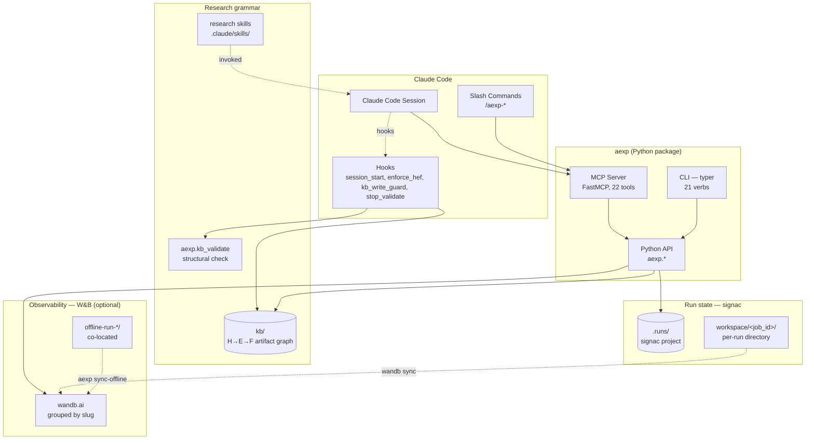

<p align="center">
    
</p>

<h1 align="center">agentic-experiments</h1>

<p align="center">
    When your agent runs ML experiments, make it run them <b>like a scientist</b>.
</p>

<p align="center">
    <a href="https://github.com/KadenMc/agentic-experiments/actions"></a>
    
    
    <a href="https://pypi.org/project/agentic-experiments/"></a>
    <a href="LICENSE"></a>
    <a href="https://github.com/sponsors/KadenMc"></a>
</p>

<p align="center">
    <a href="#quick-start">Quick Start</a> &bull;
    <a href="#how-it-works">How It Works</a> &bull;
    <a href="#why-this-is-different">Why It's Different</a> &bull;
    <a href="#features">Features</a> &bull;
    <a href="#architecture">Architecture</a> &bull;
    <a href="docs/concepts.md">Docs</a>
</p>

---

**agentic-experiments** (import name `aexp`) is an opinionated research harness for ML experimentation done *with* an AI agent — typically [Claude Code](https://docs.anthropic.com/en/docs/claude-code). It forces a **Hypothesis → Experiment → Finding** chain on every run, ties that chain to git commits, and validates citation integrity at every turn.

### What this looks like in practice

- Your agent optionally captures forward-looking research directions as **threads** (`T###`) — concerns broader than a single hypothesis, with their own lifecycle (`PROPOSED → EXPLORING → PROMOTED | CLOSED`) — and **promotes them into hypotheses** when concrete claims emerge (`aexp new-hypothesis --thread T###`)
- It proposes a hypothesis and writes it to `kb/research/hypotheses/H001-*.md` — session-start hooks refuse work that skips this step; the H/E/F template enforces a `## Caveats` + dual-mode `## Test Plan` (pre-registered vs. exploratory) so authors can't fabricate retroactive thresholds
- It designs an experiment that explicitly cites the hypothesis; a pre-write hook blocks orphaned experiments. Experiment frontmatter can declare named **`conditions:`** blocks — `--sp condition=full` resolves to the full config at queue-time and is **frozen into signac**, so later edits to `conditions.full` can't retroactively change what ran (drift-proof provenance)
- It creates signac-backed runs via the MCP tool `new_run` (or in-process via `aexp.tracked_run` for managed wandb integration) — each run records its git commit, experiment ID, hypothesis ID, and resolved sp on the job document
- For batches, it uses the **queue layer**: `aexp queue add --sweep "condition=full|cls,seed=0..3"` registers the Cartesian product as pending jobs; `aexp queue materialize --runner slurm` emits a runner script that executes wherever the user's compute lives; `aexp queue run` iterates the pending jobs in-batch-script. Designed for agent-on-laptop, training-on-cluster workflows
- A W&B run (optional) is bound via three first-class modes: `tracked_run` (managed), `prepare_tracker` + `ctx.bind(run)` (BYO `wandb.init`), or `bind_tracker` (CLI/adapter). Group slug is deterministic from `(hypothesis, experiment, condition)`
- When it writes a finding, the `supporting_runs` array must cite real jobs — `aexp validate` flags dangling references; templates enforce a `## Caveats` section distinct from `## Remaining Debt`
- Delete an experiment by accident? Every run pointing at it is flagged `run.broken_experiment_link`; missing required template headers raise `missing_template_header` on the next validation pass

### Principles

- **Hypothesis-first, not metric-first** — you can't start a run without a live hypothesis; you can't ship a finding without cited runs
- **Git is the source of truth** — every run carries its commit SHA; the knowledge base lives in git; nothing load-bearing is ephemeral
- **Integrate, don't reinvent** — [signac](https://signac.readthedocs.io) for run state, [W&B](https://wandb.ai/) for observability, and a bundled research harness for the H→E→F artifact model, templates, and methodology skills. `aexp` is the glue and the discipline
- **Portable by default** — the MCP server runs via `uvx` from PyPI; `.mcp.json` is identical on every machine and committable to git

---

## The Problem

Agents are great at running experiments. Left unattended, they are also great at running *a lot* of experiments with no shared thread — ablation sprawl, metric-chasing, findings with no clear question behind them, and a W&B workspace full of orphan runs nobody can reconstruct a month later.

The missing layer is not another tracker. It's a **grammar** — a structure the agent has to operate within, enforced deterministically by hooks rather than by reminder text in the prompt. Hypothesis before experiment. Experiment before run. Finding cites runs. Runs tied to commits.

`aexp` provides that grammar. Your agent proposes, designs, runs, and concludes; the harness makes sure the chain stays intact and the paper trail is reproducible.

---

## How It Works

`aexp` stacks three concerns — research grammar, run state, and observability — glued together with a typed Python API and three agent-facing surfaces.

| Layer | What lives here |
|---|---|
| **Research grammar** | `kb/` artifact graph — Hypothesis → Experiment → Finding plus Literature / Challenge Review / Strategic Review. Claude Code hooks enforce the H→E→F chain at write time. Four research-methodology skills (`experiment-rigor`, `exploratory-sota-research`, `research-devil-advocate`, `build-maintainable-software`) install into `.claude/skills/` |
| **Local run state** ([signac](https://signac.readthedocs.io)) | `.runs/.signac/` plus one `.runs/workspace/<job_id>/` directory per run. `job.sp` carries identity params; `job.doc` carries the artifact link, tracker IDs, status, and summary metrics |
| **Observability** (**W&B**, optional `[wandb]` extra) | Remote runs grouped by a deterministic slug derived from `(hypothesis_id, experiment_id, condition)`. Offline-by-default on HPC — `aexp sync-offline` walks the run store and syncs every pending run in one call from a login node |

### Three surfaces, one canonical API

Every operation exists in three places, all thin wrappers over the same Python functions in `aexp.*`:

| Surface | Triggered by | Best for |
|---|---|---|
| **MCP tools** (`new_run`, `list_runs`, `validate`, …) | The agent during a turn | Structured queries, programmatic chaining, typed JSON returns |
| **Slash commands** (`/aexp-new-hypothesis`, `/aexp-new-run`, `/aexp-finding-from-batch`, …) | User typing `/aexp-…` | Guided multi-step workflows |
| **CLI** (`aexp new-run ...`) | Human at a terminal | Scripts, CI, PowerShell sessions |

The **hooks** are a fourth surface — invisible to the user, they inject `kb/ACTIVE.md` at session start, block HEF-chain violations, validate KB writes, and run structural validation at turn end.

---

## Why This Is Different

Most ML experiment infrastructure records what happened. `aexp` polices what's *allowed* to happen.

- **Unlike generic trackers (W&B, MLflow, Aim)** — they log the numbers beautifully, but they don't care whether those numbers answer a question. `aexp` refuses runs that don't name their hypothesis and experiment.
- **Unlike notebook-driven research** — no commit ties, no structural validation, no citation integrity when you share the notebook three months later.
- **Unlike DIY harnesses** — this ships with working MCP integration, hook-enforced chain discipline, and a validation pass that catches broken references before they rot.

The design bet: agents already know how to run experiments. What they need is a runtime that makes rigorous research the path of least resistance.

---

## Features

### Research grammar

| | |
|---|---|
| **H→E→F artifact graph** | Every run descends from an Experiment, which descends from a Hypothesis. Findings cite runs with strong references (either specific job IDs or batch selectors). |
| **Hook-enforced discipline** | SessionStart, PreToolUse, PostToolUse, and Stop hooks inject active context, block chain violations, and validate KB integrity at turn end. Hooks ship inside the installed package and upgrade via `pip install -U`. |
| **Research methodology skills** | Four SKILL.md files install into `.claude/skills/` — experiment rigor, exploratory SOTA research, devil's advocate review, and build-maintainable-software. Trigger with `$experiment-rigor` etc. |

### Run state + observability

| | |
|---|---|
| **signac-backed runs** | Identity-hashed workspaces; idempotent creation keyed on state point; status and summary metrics in `job.doc`. Re-run at a new commit produces a distinct persistent workspace, both preserved. |
| **W&B binding** | `aexp.tracked_run(job, project=...)` for managed wandb runs; `aexp.prepare_tracker(job, ...)` if your code already calls `wandb.init` and you just want the disciplined payload + signac binding. Group slug is deterministic; offline-first; co-locates with its signac workspace. |
| **HPC-friendly sync** | `aexp sync-offline` walks the run store and runs `wandb sync` on every offline run — one command from a login node, no shell gymnastics. |
| **Tracker ABC** | `TrackerAdapter` is a small ABC used by the legacy `bind_tracker(job, adapter, ...)` path — kept for `NoopAdapter` and backend-agnostic code. See [docs/tracker-adapters.md](docs/tracker-adapters.md) for which surface to pick. |
| **Queue + runner materialization** | `aexp queue add` / `materialize` registers pending runs on one machine and emits a runner script (shell / slurm / manual) for another. Drift-proof provenance via named `conditions:` blocks in the experiment frontmatter — `--sp condition=full` resolves to the full config at queue-time so later edits to `conditions.full` can't retroactively change what ran. See [docs/queue.md](docs/queue.md). |

### Agent surfaces

| | |
|---|---|
| **MCP server** | FastMCP with 22 tools covering artifact creation (H/E/F/T), run lifecycle, batch queries, queue management (incl. `queue_stop` for live-job interruption), tracker binding, and validation. Runs via `uvx --from agentic-experiments[mcp] aexp-mcp-server` — no absolute paths, no per-machine config, `.mcp.json` committable to git. |
| **Slash commands** | Artifact creation: `/aexp-new-hypothesis`, `/aexp-new-experiment`, `/aexp-new-run`. Threads (forward-looking research concerns broader than a hypothesis): `/aexp-new-thread`, `/aexp-list-threads`, `/aexp-show-thread`, `/aexp-close-thread`. Finding creation (pick by what the finding cites): `/aexp-finding-from-run`, `/aexp-finding-from-batch`, `/aexp-finding-placeholder`. Read / inspect: `/aexp-show-run`, `/aexp-show-batch`, `/aexp-list-runs`, `/aexp-status`, `/aexp-validate`. Queue: `/aexp-queue-add`, `/aexp-queue-list`, `/aexp-queue-materialize`, `/aexp-queue-stop`. Notebook lifecycle (when `--with-jupyter` is configured): `/aexp-jupyter-iterate` (test loop), `/aexp-promote-nb` (promote working cells into a tracked-run script). Sandbox scaffolding: `/aexp-new-sandbox` (create an exploratory notebook subdir under `notebooks/_sandbox/`). 22 total. |
| **CLI** | 22 verbs covering install, artifact creation (H/E/F/T + thread lifecycle), run lifecycle, batch queries, tracker binding, validation, offline sync, optional `jupyter-setup`, the `queue` subcommand group (add/list/remove/stop/clear/materialize/run) + `run-queued`, and sandbox scaffolding (`new-sandbox`). See `aexp --help` for the full list. Python API is a one-line `from aexp import ...`. |
| **Typed JSON contracts** | Pydantic models (`RunLink`, `BatchSelector`, `Issue`, …) back the schema; MCP tools and CLI return the same shapes. |
| **Jupyter MCP integration** (optional, `[jupyter]` extra) | `aexp install --with-jupyter` adds the `jupyter` MCP server to `.mcp.json` so Claude can read/edit/execute cells in a remote JupyterLab through an existing SSH tunnel — no agent SSH required. The target Jupyter is set per-session at runtime via `connect_to_jupyter`, so one entry retargets to any node. `aexp jupyter-setup` applies the verified Jupyter Server extension state on the cluster (disable Datalayer experiments that conflict with the mainstream stack). After install, see `docs/setup/jupyter-mcp.md` for cluster-side recipe + investigation log. The `/aexp-jupyter-iterate` slash command guides the read → propose → execute loop. |

### Exploratory surfaces

| | |
|---|---|
| **Sandbox scaffolding** | `/aexp-new-sandbox` (or `aexp new-sandbox --slug ...`) creates `notebooks/_sandbox/<YYYY-MM-DD>_<slug>/` with a directional-experiment README template, a `helpers.py` skeleton, and (on first use) a sandbox-root README + `.gitignore` for large outputs. Sandbox subdirs are deliberately **outside** the H→E→F enforcement chain — agent-autonomous-write territory for free-form exploration that hasn't yet earned a tracked artifact. The `aexp.sandbox.setup_sandbox_notebook` first-cell helper closes the kernel-cwd-vs-repo-root trap on remote Jupyter setups. See [docs/sandbox.md](docs/sandbox.md). |
| **Airgapped relay** (opt-in; **skip unless your compute machine has no internet**) | If `git pull` works where you run Jupyter, you don't need this — it's not imported at package init and zero-cost to ignore. Otherwise (network-isolated compute with a sibling node that has internet and shares `$HOME` — common at HPC sites, also some clinical / government / research-lab setups): `from aexp.airgapped import RelayClient` runs whitelisted git/wandb commands on that sibling node over SSH from the laptop, against the shared-`$HOME` repo. Closed whitelist (`git_pull / push / fetch / status / rebase` auto-approved, `wandb_sync` consent-gated). One-shot setup via `aexp airgapped init`. Three surfaces: Python `RelayClient`, `aexp airgapped` CLI, and `mcp__aexp__airgapped_*` MCP tools. See [docs/airgapped.md](docs/airgapped.md). |

---

## Architecture



The **canonical Python API** (`aexp.*`) is the narrow waist. MCP, CLI, and slash commands all delegate to it; they differ only in how they're triggered.

---

## Quick Start

**Prerequisites:** Python 3.11+ and [`uv`](https://docs.astral.sh/uv/) on `PATH` (Claude Code uses `uvx` to run the MCP server).

From inside your research repo, with a virtual environment active:

```bash
pip install "agentic-experiments[wandb,mcp]"
aexp install
aexp --help
```

> **Heads up — `aexp install` will modify your repo.** It creates `.mcp.json`, **merges into** any existing `.claude/settings.json` (hooks + permissions are additive; yours are preserved), adds `.claude/skills/` with four research-methodology skills, copies a `kb/` scaffold plus `templates/` into the repo root, initializes `.runs/` as a signac project, and records the interpreter path in `.aexp/installed.json`. It prints the plan and asks for confirmation before writing — pass `--yes` to skip the prompt or `--dry-run` to preview only. **No Python code you didn't write lands in your repo**: hook scripts and validator logic live inside the installed `aexp` package and upgrade via `pip install -U`.

See [docs/quickstart.md](docs/quickstart.md) for a full worked example — hypothesis → experiment → runs → finding.

### Extras

| Extra | Installs | When to use |
|---|---|---|
| `mcp` | `mcp` | Claude Code MCP server (almost always wanted) |
| `wandb` | `wandb` | W&B tracker adapter for remote observability |

`pip install agentic-experiments` alone gets you the CLI and Python API. The extras are additive.

### Invoking the CLI from inside Claude Code

Three equivalent entry points, listed in order of robustness under agent runtimes:

| Form | Best when |
|---|---|
| `conda run -n <env> python -m aexp <verb>` | Most robust inside Claude Code. Works on Windows / macOS / Linux without shell activation. |
| `python -m aexp <verb>` | Works when `python` resolves to the env — e.g. an activated shell or a venv install. |
| `aexp <verb>` | Shortest; only on PATH in human terminals with the env active. |

`.aexp/installed.json` records the interpreter path and conda env name at install time, so slash commands + the MCP server never have to guess.

---

## Stop-hook scope caveat

When a Claude Code session ends, the Stop hook runs `aexp.kb_validate` — a **KB-structural** check (frontmatter, aliases, wikilinks, bidirectional backlinks, H→E→F chain). It does **not** run `aexp`'s run-link / finding-citation validator.

So a session can end cleanly with a broken `supporting_runs` citation still present. Run `aexp validate` explicitly for full-coverage validation; treat Stop hook success as "KB structurally sound" rather than "everything coherent."

---

## Documentation

| Doc | What it covers |
|---|---|
| [docs/concepts.md](docs/concepts.md) | The H→E→F grammar, batches, findings, validation layers |
| [docs/quickstart.md](docs/quickstart.md) | A full worked example — bootstrap to finding |
| [docs/cli.md](docs/cli.md) | Complete CLI reference, verb by verb |
| [docs/mcp.md](docs/mcp.md) | MCP server tools, transport, verification prompt, troubleshooting |
| [docs/mapping.md](docs/mapping.md) | `kb/` ↔ signac ↔ W&B mapping in gory detail |
| [docs/tracker-adapters.md](docs/tracker-adapters.md) | Writing a new tracker adapter; why Weave isn't in v1 |
| [docs/queue.md](docs/queue.md) | Queue, runner-script materialization, sp resolution, drift-proof provenance, cross-machine sync |
| [docs/threads.md](docs/threads.md) | Threads (`T###`) — forward-looking research concerns broader than a hypothesis: lifecycle, linkage to H/E/F, required template sections |
| [docs/sandbox.md](docs/sandbox.md) | Sandbox scaffolding — `notebooks/_sandbox/` layout, the `/aexp-new-sandbox` slash command, the notebook first-cell convention, promotion path to tracked artifacts |
| [docs/airgapped.md](docs/airgapped.md) | Airgapped relay — per-call SSH bridge that runs whitelisted git/wandb commands on an internet-having login node; SSH/ControlMaster setup, client API, CLI, MCP tools, whitelist, consent |

---

## Project layout

```
src/aexp/
  __init__.py           # public API re-exports
  cli.py                # Typer app (aexp)
  __main__.py           # python -m aexp → CLI
  install.py            # apply the harness into a consumer repo
  runs.py               # signac wrappers: create_run, open_run, find_runs, run_lifecycle
  linking.py            # batch queries + retroactive run-to-experiment linking
  kb_io.py              # typed read wrappers for H/E/F/L/CR/SR artifacts
  validate.py           # composes KB structural + run-link + citation integrity
  kb_validate.py        # KB structural validator (frontmatter, aliases, chain)
  schema.py             # pydantic + dataclass types
  mcp_server.py         # FastMCP server — optional [mcp] extra
  sandbox.py            # scaffold notebooks/_sandbox/<date>_<slug>/ + setup_sandbox_notebook
  airgapped/            # opt-in: SSH relay to a login node for airgapped compute (RelayClient)
  hooks/                # Claude Code hooks (session_start, enforce_hef_chain, kb_write_guard, stop_validate)
  slash_commands/       # /aexp-* templates
  trackers/             # TrackerAdapter ABC + noop + wandb adapters
  utils/                # paths, git, atomic writes
  scaffold/             # research-graph scaffold: kb/, templates, skills, agent contracts
tests/                  # pytest suite; CI on Ubuntu + Windows × Py 3.11/3.12/3.13
docs/                   # concepts, quickstart, cli, mcp, mapping, tracker-adapters, queue, threads, sandbox, airgapped
```

---

## Status

**Pre-release (v0.2.x).** Actively developed by one person and the agents they direct; used in the author's own ML research workflow. The API surface is not yet stable — see [CHANGELOG.md](CHANGELOG.md) for what has shipped.

- **Developed and primarily tested on Windows 11 / Python 3.12.** Supports Python 3.11+. CI runs the full suite on Ubuntu + Windows × Py 3.11/3.12/3.13. macOS hasn't been exercised — issues welcome.
- **MCP server is the only PyPI-gated surface** — the CLI and Python API run from a local checkout without any PyPI round-trip.
- **v0.3 backlog:** `aexp index` dashboard, MLflow / Aim / DVC tracker adapters, OpenTelemetry extra. (Artifact-creation CLI verbs, the three-mode wandb surface, the queue + runner-materialization layer, threads as a new artifact kind, and template/validator strictness all shipped in 0.2.0 — see CHANGELOG for the full breakdown.)

If you run ML experiments with Claude Code and find yourself wanting a harness that holds your agent to scientific discipline, this is built for you. Feedback, bug reports, and PRs all welcome.

---

## Contributing

For bugs and feature requests, [open an issue](https://github.com/KadenMc/agentic-experiments/issues).

### Hacking on the package itself

```bash
git clone https://github.com/KadenMc/agentic-experiments.git
cd agentic-experiments
poetry install --with dev --extras "wandb mcp"

poetry run pytest              # `-m "not slow"` skips the e2e smoke
poetry run ruff check .
```

Python 3.11, 3.12, and 3.13 are all exercised in CI on Ubuntu and Windows.

### Developing `aexp` against one of your own research repos

You can test local `aexp` changes live inside a real consumer repo — no publish cycle. Editable-install `aexp` into the target repo's env, then run `aexp install --dev` so its `.mcp.json` wires the MCP server through your local interpreter instead of `uvx` / PyPI:

```bash
# from the target repo's env (conda, venv, poetry run, etc.)
pip install -e "/path/to/agentic-experiments[wandb,mcp]"

cd /path/to/target-repo
aexp install --dev --yes
```

Every edit to `src/aexp/*.py` is now live in:

- the `aexp` CLI and `python -m aexp.*` invocations
- the Claude Code hooks (fresh subprocess per call)
- the MCP server — but only after a Claude Code restart (or an `/mcp` disconnect/reconnect of the `aexp` server), since the server is a long-running subprocess that doesn't hot-reload

> `--dev` bakes your machine's Python path into `.mcp.json`. **Do not commit that form** — gitignore it while iterating, or re-run `aexp install --force` (without `--dev`) to regenerate the portable `uvx` form before committing.

---

## Acknowledgements

The research harness — the H→E→F artifact model, the `kb/` layout,
artifact templates, and methodology skills — was adapted from
[limina](https://github.com/KadenMc/limina).

## License

[MIT](LICENSE)
